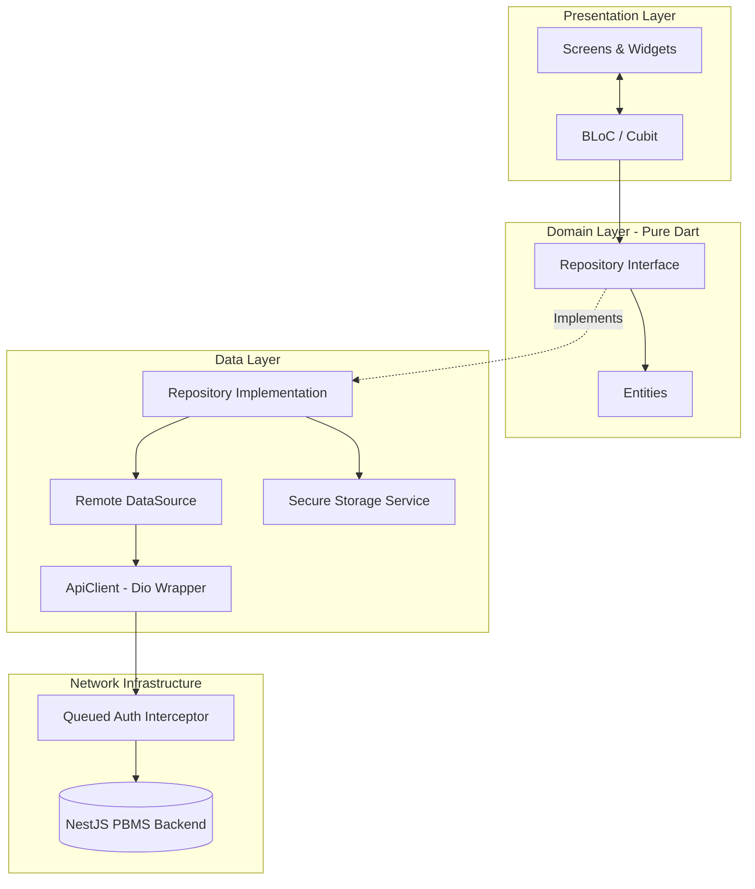

# 🅿️ PRM393 · Smart Parking Management System (PBMS) - Flutter Frontend

<div align="center">

**Ứng dụng Quản lý Bãi đỗ xe Thông minh · Flutter Multiplatform (iOS, Android, Web, Windows)**

[](https://flutter.dev)
[](https://dart.dev)
[](https://bloclibrary.dev)
[](#-tổng-quan-kiến-trúc-frontend)
[](LICENSE)

</div>

---

## 📌 Mục lục
- [🏗️ Tổng quan kiến trúc Frontend](#-tổng-quan-kiến-trúc-frontend)
- [🎨 Ngôn ngữ thiết kế (Web-inspired Modern Aesthetic)](#-ngôn-ngữ-thiết-kế-web-inspired-modern-aesthetic)
- [📱 Cơ chế Responsive Mobile & Chống tràn](#-cơ-chế-responsive-mobile--chống-tràn)
- [📂 Cây thư mục dự án (`lib/`)](#-cây-thư-mục-dự-án-lib)
- [🚀 Hướng dẫn cài đặt & Khởi chạy](#-hướng-dẫn-cài-đặt--khởi-chạy)
- [🔗 Tích hợp API Backend NestJS](#-tích-hợp-api-backend-nestjs)

---

## 🏗️ Tổng quan kiến trúc Frontend

Ứng dụng được thiết kế theo tiêu chuẩn **Clean Architecture** kết hợp phân tách theo mô hình **Feature-First**, tối ưu khả năng mở rộng (scalability), kiểm thử độc lập (testability) và bảo trì dài hạn (maintainability).



### 1. Phân tầng kiến trúc
- **Presentation Layer**: Chịu trách nhiệm hiển thị giao diện và nhận tương tác từ người dùng. Logic giao diện được quản lý hoàn toàn bằng **Flutter BLoC** (Event - State), tách biệt 100% khỏi widget rendering.
- **Domain Layer**: Tầng lõi nghiệp vụ thuần Dart, không phụ thuộc vào Flutter framework hay thư viện ngoài. Định nghĩa các `Entities` và hợp đồng trừu tượng `Repository Interfaces`.
- **Data Layer**: Hiện thực hóa các interface từ Domain Layer. Bao gồm `DataSources` (gọi REST API), `Models` (chuyển đổi JSON an toàn theo chuẩn Backend), và `StorageService` (lưu trữ token mã hóa).

### 2. State Management: Flutter BLoC
- Sử dụng `flutter_bloc` (^9.1.1) kết hợp `equatable` (^2.0.7) để so sánh trạng thái theo giá trị (value equality).
- Đảm bảo luồng dữ liệu một chiều (**Unidirectional Data Flow**):
  $$\text{User Action} \longrightarrow \text{Event} \longrightarrow \text{BLoC Logic} \longrightarrow \text{New State} \longrightarrow \text{UI Rebuild}$$
- Xử lý mượt mà các trạng thái: `Initial`, `Loading`, `Authenticated`, `Unauthenticated`, và `Failure`.

### 3. Network Layer & Refresh Token Queue
- **Dio Client Typed**: Cung cấp các hàm `get<T>`, `post<T>`, `put<T>`, `patch<T>`, `delete<T>` bọc sẵn envelope chuẩn PBMS:
  ```json
  {
    "statusCode": 200,
    "message": "Thông điệp phản hồi",
    "isSuccess": true,
    "result": { ... }
  }
  ```
- **Queued Auth Interceptor**:
  - Tự động tiêm `Authorization: Bearer <accessToken>` vào headers của mọi request cần xác thực.
  - Bắt lỗi **HTTP 401 Unauthorized**: Tự động gọi endpoint `POST /api/Auth/refresh-token` với payload `{"refreshTokenKey": "<refreshToken>"}`.
  - Sử dụng cơ chế hàng đợi bất đồng bộ (**Completer Mutex Queue**): Khi có nhiều request đồng thời nhận lỗi 401, chỉ **1 request duy nhất** được phép gọi refresh token; các request còn lại sẽ tạm dừng chờ và tự động retry lại với token mới ngay sau đó.
- **Bảo mật lưu trữ**: Token được lưu trong `FlutterSecureStorage` (sử dụng Keychain trên iOS/macOS và Keystore EncryptedSharedPreferences trên Android).

## 📂 Cây thư mục dự án (`lib/`)

```
lib/
├── app.dart                                # Khởi tạo MaterialApp.router & cấu hình ThemeMode
├── main.dart                               # Khởi tạo DI (Service, Repository, BLoC Provider)
│
├── core/                                   # Mã nguồn hạ tầng dùng chung (Shared Core)
│   ├── config/
│   │   ├── api_endpoints.dart              # Quản lý 126 endpoints backend (chuẩn casing: /api/Auth, /api/reservations,...)
│   │   └── app_config.dart                 # Cấu hình môi trường (Cloud Render Backend / Localhost)
│   ├── constants/
│   │   └── storage_keys.dart               # Hằng số định danh bộ nhớ mã hóa (Keychain/Keystore)
│   ├── error/
│   │   ├── app_exception.dart              # Hệ thống Exception ánh xạ mã HTTP (400, 401, 403, 404, 409, 500)
│   │   └── failure.dart                    # Domain Failures trả về Presentation Layer
│   ├── network/
│   │   ├── api_client.dart                 # Base Client Dio với kiểu dữ liệu trả về Type-safe
│   │   ├── api_response.dart               # Generic PBMS Envelope { statusCode, message, isSuccess, result }
│   │   ├── auth_interceptor.dart           # QueuedInterceptor: Tiêm Bearer & tự động Refresh Token khi gặp 401
│   │   └── logging_interceptor.dart        # Logger định dạng console box trực quan trong Debug Mode
│   ├── routes/
│   │   ├── app_router.dart                 # Cấu hình GoRouter với Auth Guard redirect tự động
│   │   └── route_names.dart                # Tên định danh và đường dẫn URL của các màn hình
│   ├── storage/
│   │   └── secure_storage_service.dart     # Service lưu trữ token bảo mật bằng FlutterSecureStorage
│   ├── theme/
│   │   ├── app_colors.dart                 # Bảng mã màu Design Tokens (Primary, Status, Light/Dark)
│   │   ├── app_spacing.dart                # Thước đo khoảng cách (Padding, Margin, Border Radius)
│   │   ├── app_theme.dart                  # Cấu hình Material 3 ThemeData cho cả Light & Dark
│   │   └── app_typography.dart             # Cấu hình Typography Google Fonts (Outfit & Inter)
│   └── utils/
│       ├── currency_formatter.dart         # Định dạng tiền tệ VNĐ (ví dụ: 25.000 ₫)
│       └── date_formatter.dart             # Định dạng mốc thời gian vào/ra, đặt chỗ (HH:mm - dd/MM/yyyy)
│
└── features/                               # Các mô-đun chức năng (Feature-First Modules)
    ├── auth/                               # Feature: Xác thực & Tài khoản
    │   ├── data/
    │   │   ├── datasources/
    │   │   │   └── auth_remote_datasource.dart # Gọi POST /api/Auth/login, profile, logout
    │   │   ├── models/
    │   │   │   ├── auth_tokens_model.dart      # Parse accessToken, refreshToken, user
    │   │   │   ├── login_request_dto.dart      # DTO email, password gửi lên backend
    │   │   │   └── user_model.dart             # Parse User JSON an toàn
    │   │   └── repositories/
    │   │       └── auth_repository_impl.dart   # Quản lý lưu token, kiểm tra JWT expiration
    │   ├── domain/
    │   │   ├── entities/
    │   │   │   └── user_entity.dart            # Thực thể User thuần túy trong Domain
    │   │   └── repositories/
    │   │       └── auth_repository.dart        # Interface hợp đồng xác thực
    │   └── presentation/
    │       ├── blocs/
    │       │   ├── auth_bloc.dart              # Xử lý login, auto check session, logout
    │       │   ├── auth_event.dart             # Các sự kiện xác thực
    │       │   └── auth_state.dart             # Trạng thái xác thực (Loading, Authenticated,...)
    │       └── screens/
    │           ├── login_screen.dart           # Giao diện Đăng nhập chuẩn Responsive
    │           └── splash_screen.dart          # Màn hình Splash kiểm tra trạng thái khởi động
    │
    └── home/                               # Feature: Dashboard & Trang chủ
        └── presentation/
            └── screens/
                └── home_screen.dart            # Tổng quan bãi xe, chỗ trống, lối tắt, thẻ xe đang đỗ
```

---

## 🚀 Hướng dẫn cài đặt & Khởi chạy

### 1. Chuẩn bị môi trường
Yêu cầu đã cài đặt Flutter SDK phiên bản `^3.47` (Dart `^3.13`) và cấu hình Android Studio / Xcode / Chrome.

### 2. Cài đặt Dependencies
Từ thư mục `Frontend/`:
```bash
flutter pub get
```

### 3. Chạy Code Generation (nếu có cập nhật Models)
```bash
dart run build_runner build --delete-conflicting-outputs
```

### 4. Kiểm tra chất lượng mã nguồn
```bash
# Kiểm tra linter tĩnh (Hiện tại: 0 issues found)
flutter analyze

# Chạy Unit & Smoke tests (Hiện tại: All tests passed)
flutter test
```

### 5. Khởi chạy ứng dụng

#### 🌐 Trên trình duyệt Web (Google Chrome):
Backend trên Render đang cấu hình whitelist CORS mặc định cho `http://localhost:5173`. Do đó hãy chạy kèm cờ `--web-port=5173`:
```bash
flutter run -d chrome --web-port=5173
```

#### 🖥️ Trên Windows Desktop (Không bị giới hạn CORS):
```bash
flutter run -d windows
```

#### 📱 Trên Android Emulator / Thiết bị thật:
```bash
flutter run -d android
```

---

## 🔗 Tích hợp API Backend NestJS

Ứng dụng kết nối trực tiếp với Backend PBMS qua domain đã triển khai:
- **Cloud Backend Origin**: `https://prm393-backend-u2ym.onrender.com`
- **Swagger Documentation**: [https://prm393-backend-u2ym.onrender.com/api/docs](https://prm393-backend-u2ym.onrender.com/api/docs)
- **Tài khoản kiểm thử**: Có thể tạo tài khoản qua luồng `POST /api/Auth/send-register-otp` và `POST /api/Auth/verify-register-otp` trên Swagger, hoặc sử dụng tài khoản đã kích hoạt trong database Supabase.
